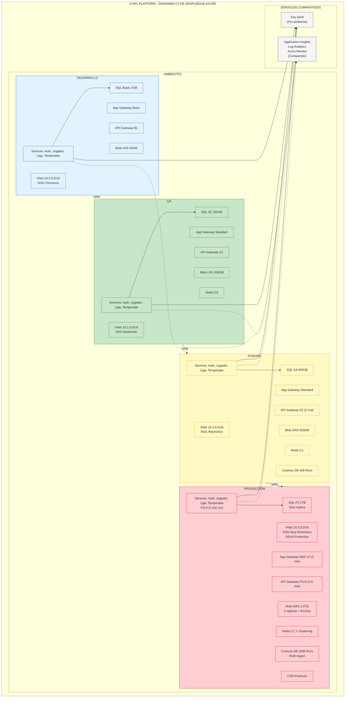
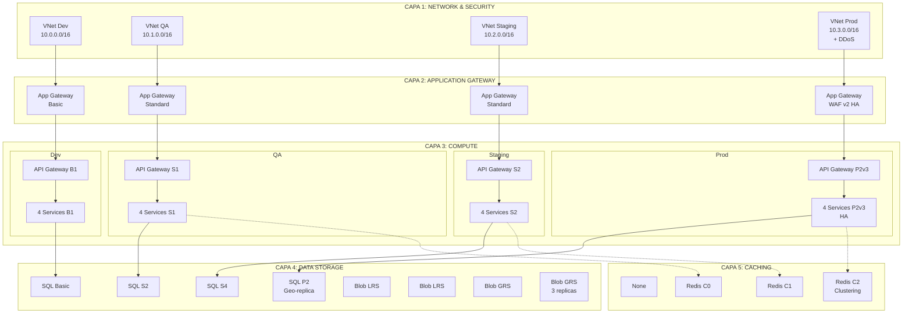

# Diagrama C2 de Despliegue Azure - Código Mermaid
## X-NFL Platform - Arquitectura Multi-Ambiente

Este documento contiene el código Mermaid para generar el diagrama de arquitectura de infraestructura Azure.

---

## Diagrama Completo (Versión Principal)

```mermaid
graph TB
    subgraph title["X-NFL PLATFORM - DIAGRAMA C2 DE DESPLIEGUE AZURE<br/>Arquitectura Multi-Ambiente (Dev, QA, Staging, Producción)<br/>Diciembre 2024"]
        direction TB
        
        subgraph layer1["LAYER 1: NETWORK & SECURITY"]
            direction LR
            
            subgraph dev1["DESARROLLO"]
                vnetdev["VNet Dev<br/>10.0.0.0/16"]
                subdev1["Subnet Frontend<br/>10.0.1.0/24"]
                subdev2["Subnet App<br/>10.0.2.0/24"]
                subdev3["Subnet Database<br/>10.0.3.0/24"]
                nsgdev["NSG<br/>Permisivo"]
                
                vnetdev --> subdev1
                vnetdev --> subdev2
                vnetdev --> subdev3
                vnetdev --> nsgdev
            end
            
            subgraph qa1["QA"]
                vnetqa["VNet QA<br/>10.1.0.0/16"]
                subqa1["Subnet Frontend<br/>10.1.1.0/24"]
                subqa2["Subnet App<br/>10.1.2.0/24"]
                subqa3["Subnet Database<br/>10.1.3.0/24"]
                nsgqa["NSG<br/>Moderado"]
                
                vnetqa --> subqa1
                vnetqa --> subqa2
                vnetqa --> subqa3
                vnetqa --> nsgqa
            end
            
            subgraph staging1["STAGING"]
                vnetstg["VNet Staging<br/>10.2.0.0/16"]
                substg1["Subnet Frontend<br/>10.2.1.0/24"]
                substg2["Subnet App<br/>10.2.2.0/24"]
                substg3["Subnet Database<br/>10.2.3.0/24"]
                nsgstg["NSG<br/>Restrictivo"]
                
                vnetstg --> substg1
                vnetstg --> substg2
                vnetstg --> substg3
                vnetstg --> nsgstg
            end
            
            subgraph prod1["PRODUCCIÓN"]
                vnetprod["VNet Prod<br/>10.3.0.0/16"]
                subprod1["Subnet Frontend<br/>10.3.1.0/24"]
                subprod2["Subnet App<br/>10.3.2.0/24"]
                subprod3["Subnet Database<br/>10.3.3.0/24"]
                nsgprod["NSG<br/>Muy Restrictivo"]
                ddos["Azure DDoS Protection<br/>Standard"]
                
                vnetprod --> subprod1
                vnetprod --> subprod2
                vnetprod --> subprod3
                vnetprod --> nsgprod
                vnetprod --> ddos
            end
        end
        
        subgraph layer2["LAYER 2: APPLICATION GATEWAY & LOAD BALANCING"]
            direction LR
            
            subgraph dev2["DESARROLLO"]
                appgwdev["Application Gateway<br/>Basic SKU<br/>1 instancia"]
                lbdev["Load Balancer Interno<br/>Basic"]
                appgwdev --> lbdev
            end
            
            subgraph qa2["QA"]
                appgwqa["Application Gateway<br/>Standard<br/>1 instancia"]
                lbqa["Load Balancer Interno<br/>Standard"]
                appgwqa --> lbqa
            end
            
            subgraph staging2["STAGING"]
                appgwstg["Application Gateway<br/>Standard<br/>1 instancia"]
                lbstg["Load Balancer Interno<br/>Standard"]
                appgwstg --> lbstg
            end
            
            subgraph prod2["PRODUCCIÓN"]
                appgwprod["Application Gateway<br/>WAF v2<br/>2 instancias HA"]
                lbprod["Load Balancer Interno<br/>Standard"]
                appgwprod --> lbprod
            end
        end
        
        subgraph layer3["LAYER 3: COMPUTE - APPLICATION SERVICES"]
            direction LR
            
            subgraph dev3["DESARROLLO"]
                apigwdev["API Gateway<br/>App Service B1<br/>1 inst<br/>Auto-scale: 1-2"]
                authdev["Auth Service<br/>B1 (1 inst)"]
                jugdev["Jugador Service<br/>B1 (1 inst)"]
                ligadev["Liga Service<br/>B1 (1 inst)"]
                tempdev["Temporada Service<br/>B1 (1 inst)"]
                
                lbdev --> apigwdev
                apigwdev --> authdev
                apigwdev --> jugdev
                apigwdev --> ligadev
                apigwdev --> tempdev
            end
            
            subgraph qa3["QA"]
                apigwqa["API Gateway<br/>App Service S1<br/>1 inst<br/>Auto-scale: 1-3"]
                authqa["Auth Service<br/>S1 (1 inst)"]
                jugqa["Jugador Service<br/>S1 (1 inst)"]
                ligaqa["Liga Service<br/>S1 (1 inst)"]
                tempqa["Temporada Service<br/>S1 (1 inst)"]
                
                lbqa --> apigwqa
                apigwqa --> authqa
                apigwqa --> jugqa
                apigwqa --> ligaqa
                apigwqa --> tempqa
            end
            
            subgraph staging3["STAGING"]
                apigwstg["API Gateway<br/>App Service S2<br/>2 inst<br/>Auto-scale: 2-4"]
                authstg["Auth Service<br/>S2 (2 inst)"]
                jugstg["Jugador Service<br/>S2 (2 inst)"]
                ligastg["Liga Service<br/>S2 (2 inst)"]
                tempstg["Temporada Service<br/>S2 (2 inst)"]
                
                lbstg --> apigwstg
                apigwstg --> authstg
                apigwstg --> jugstg
                apigwstg --> ligastg
                apigwstg --> tempstg
            end
            
            subgraph prod3["PRODUCCIÓN"]
                apigwprod["API Gateway<br/>App Service P2v3<br/>3 inst<br/>Auto-scale: 3-6"]
                authprod["Auth Service<br/>P2v3 (2 inst)"]
                jugprod["Jugador Service<br/>P2v3 (2 inst)"]
                ligaprod["Liga Service<br/>P2v3 (2 inst)"]
                tempprod["Temporada Service<br/>P2v3 (2 inst)"]
                
                lbprod --> apigwprod
                apigwprod --> authprod
                apigwprod --> jugprod
                apigwprod --> ligaprod
                apigwprod --> tempprod
            end
        end
        
        subgraph layer4["LAYER 4: DATA STORAGE"]
            direction LR
            
            subgraph dev4["DESARROLLO"]
                sqldev["SQL Database Dev<br/>Basic (5 DTU)<br/>2 GB<br/>No backup"]
                blobdev["Blob Storage Dev<br/>Hot (LRS)<br/>~50 GB<br/>1 replica"]
                cosmosdev["Cosmos DB<br/>(None)"]
                
                authdev -.-> sqldev
                jugdev -.-> sqldev
                ligadev -.-> sqldev
                tempdev -.-> sqldev
                jugdev -.-> blobdev
            end
            
            subgraph qa4["QA"]
                sqlqa["SQL Database QA<br/>S2 (50 DTU)<br/>250 GB<br/>7d backup"]
                blobqa["Blob Storage QA<br/>Hot (LRS)<br/>~200 GB<br/>1 replica"]
                cosmosqa["Cosmos DB<br/>(None)"]
                
                authqa -.-> sqlqa
                jugqa -.-> sqlqa
                ligaqa -.-> sqlqa
                tempqa -.-> sqlqa
                jugqa -.-> blobqa
            end
            
            subgraph staging4["STAGING"]
                sqlstg["SQL Database Staging<br/>S4 (200 DTU)<br/>500 GB<br/>14d backup"]
                blobstg["Blob Storage Staging<br/>Hot (GRS)<br/>~500 GB<br/>2 replicas"]
                cosmosstg["Cosmos DB Staging<br/>400 RU/s<br/>Single region"]
                
                authstg -.-> sqlstg
                jugstg -.-> sqlstg
                ligastg -.-> sqlstg
                tempstg -.-> sqlstg
                jugstg -.-> blobstg
                jugstg -.-> cosmosstg
            end
            
            subgraph prod4["PRODUCCIÓN"]
                sqlprod["SQL Database Prod<br/>P2 (250 DTU)<br/>1 TB<br/>35d backup<br/>Geo-replica"]
                blobprod["Blob Storage Prod<br/>Hot (GRS)<br/>~1.5 TB<br/>3 replicas<br/>+ Archive"]
                cosmosprod["Cosmos DB Prod<br/>1000 RU/s<br/>Multi-region"]
                
                authprod -.-> sqlprod
                jugprod -.-> sqlprod
                ligaprod -.-> sqlprod
                tempprod -.-> sqlprod
                jugprod -.-> blobprod
                jugprod -.-> cosmosprod
            end
        end
        
        subgraph layer5["LAYER 5: CACHING & MESSAGING"]
            direction LR
            
            subgraph dev5["DESARROLLO"]
                redisdev["Redis Cache<br/>(None)"]
                busdev["Service Bus<br/>(None)"]
            end
            
            subgraph qa5["QA"]
                redisqa["Azure Redis Cache<br/>C0 (250 MB)"]
                busqa["Service Bus<br/>Basic"]
                
                authqa -.-> redisqa
                jugqa -.-> redisqa
                authqa -.-> busqa
            end
            
            subgraph staging5["STAGING"]
                redisstg["Azure Redis Cache<br/>C1 (1 GB)"]
                busstg["Service Bus<br/>Standard"]
                
                authstg -.-> redisstg
                jugstg -.-> redisstg
                authstg -.-> busstg
            end
            
            subgraph prod5["PRODUCCIÓN"]
                redisprod["Azure Redis Cache<br/>C2 (2.5 GB)<br/>+ Clustering"]
                busprod["Service Bus<br/>Premium<br/>+ Geo-DR"]
                
                authprod -.-> redisprod
                jugprod -.-> redisprod
                authprod -.-> busprod
            end
        end
        
        subgraph layer6["LAYER 6: CDN & CONTENT DELIVERY"]
            direction LR
            
            cdndev["Azure CDN<br/>(None)"]
            cdnqa["Azure CDN<br/>Standard"]
            cdnstg["Azure CDN<br/>Standard"]
            cdnprod["Azure CDN<br/>Premium<br/>Global Edge"]
            
            blobqa -.-> cdnqa
            blobstg -.-> cdnstg
            blobprod -.-> cdnprod
        end
        
        subgraph layer7["LAYER 7: SECURITY & SECRETS MANAGEMENT"]
            direction LR
            
            kvdev["Key Vault Dev<br/>Standard<br/>Soft delete"]
            kvqa["Key Vault QA<br/>Standard<br/>Soft delete"]
            kvstg["Key Vault Staging<br/>Standard<br/>Soft delete"]
            kvprod["Key Vault Prod<br/>Premium<br/>Soft delete<br/>+ Purge protection"]
            
            authdev -.-> kvdev
            authqa -.-> kvqa
            authstg -.-> kvstg
            authprod -.-> kvprod
        end
        
        subgraph layer8["LAYER 8: MONITORING & LOGGING"]
            direction LR
            
            monitor["SHARED MONITORING SERVICES<br/>(Compartidos entre ambientes)"]
            ai["Application Insights<br/>(All environments)"]
            la["Log Analytics Workspace<br/>(Shared)"]
            am["Azure Monitor<br/>(All environments)"]
            
            monitor --> ai
            monitor --> la
            monitor --> am
            
            authdev -.-> ai
            jugdev -.-> ai
            authqa -.-> ai
            jugqa -.-> ai
            authstg -.-> ai
            jugstg -.-> ai
            authprod -.-> ai
            jugprod -.-> ai
        end
        
        subgraph connectivity["CONNECTIVITY BETWEEN ENVIRONMENTS"]
            direction LR
            dev1 -.->|VPN Gateway| qa1
            qa1 -.->|VPN Gateway| staging1
            staging1 -.->|VPN Gateway| prod1
            note1["VNet Peering para comunicación<br/>controlada entre ambientes"]
        end
    end
    
    classDef vnetStyle fill:#E3F2FD,stroke:#1976D2,stroke-width:3px
    classDef appStyle fill:#C8E6C9,stroke:#388E3C,stroke-width:2px
    classDef dbStyle fill:#FFE0B2,stroke:#F57C00,stroke-width:2px
    classDef storageStyle fill:#EEEEEE,stroke:#616161,stroke-width:2px
    classDef lbStyle fill:#E1BEE7,stroke:#7B1FA2,stroke-width:2px
    classDef securityStyle fill:#FFCDD2,stroke:#C62828,stroke-width:2px
    classDef monitorStyle fill:#FFF9C4,stroke:#F9A825,stroke-width:2px
    classDef cdnStyle fill:#B2EBF2,stroke:#0097A7,stroke-width:2px
    classDef cacheStyle fill:#F8BBD0,stroke:#C2185B,stroke-width:2px
    
    class vnetdev,vnetqa,vnetstg,vnetprod,subdev1,subdev2,subdev3,subqa1,subqa2,subqa3,substg1,substg2,substg3,subprod1,subprod2,subprod3 vnetStyle
    class apigwdev,apigwqa,apigwstg,apigwprod,authdev,authqa,authstg,authprod,jugdev,jugqa,jugstg,jugprod,ligadev,ligaqa,ligastg,ligaprod,tempdev,tempqa,tempstg,tempprod appStyle
    class sqldev,sqlqa,sqlstg,sqlprod,cosmosstg,cosmosprod dbStyle
    class blobdev,blobqa,blobstg,blobprod storageStyle
    class appgwdev,appgwqa,appgwstg,appgwprod,lbdev,lbqa,lbstg,lbprod lbStyle
    class nsgdev,nsgqa,nsgstg,nsgprod,kvdev,kvqa,kvstg,kvprod,ddos securityStyle
    class ai,la,am monitorStyle
    class cdnqa,cdnstg,cdnprod cdnStyle
    class redisqa,redisstg,redisprod,busqa,busstg,busprod cacheStyle
```

---

## Versión Simplificada (Alternativa)

Si el diagrama anterior es demasiado complejo para Mermaid, aquí hay una versión más simplificada:

---

## Versión por Capas (Más Detallada)

Si prefieres ver cada capa por separado, aquí tienes una versión que muestra las capas principales:

---

## Notas de Uso

1. **Renderizado**: Puedes usar estos códigos en:
   - GitHub (soporta Mermaid nativamente)
   - Mermaid Live Editor: https://mermaid.live/
   - VS Code con extensión Mermaid
   - Obsidian (si tienes el plugin)
   - Cualquier herramienta que soporte Mermaid

2. **Limitaciones de Mermaid**:
   - Los diagramas muy complejos pueden no renderizarse perfectamente
   - Las etiquetas largas pueden verse cortadas
   - Los colores personalizados funcionan mejor en algunas plataformas

3. **Recomendaciones**:
   - Usa la versión simplificada si la completa no se renderiza bien
   - Puedes dividir el diagrama en múltiples diagramas más pequeños
   - Considera usar Draw.io o Lucidchart para versiones más detalladas

4. **Personalización**:
   - Puedes ajustar los colores en las clases `classDef`
   - Puedes modificar las etiquetas de texto dentro de los nodos
   - Puedes agregar más conexiones con `-->` (sólida) o `-.->` (punteada)

---

**Última actualización**: Diciembre 2024
